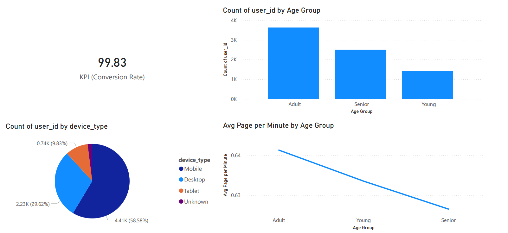

# User Behavior Analysis & Purchase Prediction Dashboard

## Project Overview
This project analyzes a dataset of 8,000 user sessions to identify patterns leading to purchases and to detect potential bottlenecks in the conversion funnel. Despite a high overall conversion rate (99.8%), the analysis focuses on segmenting user behavior and identifying technical/UX issues for the remaining 0.2%.

## Key Insights
- **The Engagement Paradox:** The `Adult` group on `Mobile` devices shows the highest conversion efficiency with the lowest `Engagement Index`. This suggests a highly optimized mobile path-to-purchase for this demographic.
- **Technical Drop-off:** Non-purchasers (0.17%) exhibit a `Bounce Rate` > 90%, primarily on mobile devices. This points toward a potential technical issue or slow loading times for specific mobile segments.
- **Customer Loyalty:** High average of previous purchases (~6.9) across all segments indicates strong brand retention and repeat customer value.

## Visualizations Included
1. **Conversion KPI Card:** Real-time tracking of purchase rates.
2. **Behavioral Matrix:** Cross-analysis of Device Type and Age Groups against previous purchases and engagement.
3. **Decomposition Tree:** An AI-powered path analysis showing the most significant influencers for completed purchases.
4. **Engagement vs. Conversion Line Chart:** Visualizing the correlation between session depth and final conversion.

## Tech Stack & Data Engineering
- **Power Query (M):** 
  - Data cleaning and normalization.
  - Feature Engineering: Created `Age Groups` (Young, Adult, Senior).
  - Handled missing values by replacing nulls with "Unknown" for categorical data.
- **DAX Measures:**
  - `Conversion Rate`: `%` of successful purchases.
  - `User Engagement Index`: A weighted score based on `time_on_site` and `pages_viewed`.
  - `Avg Pages per Minute`: Efficiency metric for user sessions.

## How to View
1. Download the `User_Behavior_Analysis.pbix` file.
2. Open with [Power BI Desktop](https://powerbi.microsoft.com/desktop/).
3. (Optional) View the PDF summary in the `/exports` folder.

# Logic & Formulas

## 1. Data Engineering (Power Query / M Language)
Before analyzing, raw data was transformed to ensure consistency:
Null Handling: Empty values in device_type and gender were replaced with "Unknown" to maintain data integrity without losing records.
Target Cleaning: Rows with missing purchase data were removed to focus on confirmed outcomes.
Age Segmentation: Created a conditional column Age Group to categorize users:

Young (<= 25)

Adult (26 - 45)

Senior (> 45)

## 2. Key Measures (DAX Formulas)
You can find the core logic of the dashboard in these formulas:

### A. Conversion Rate
This measure calculates the percentage of users who completed a purchase.

<> DAX Conversion Rate = DIVIDE( CALCULATE(COUNT('Users'[purchase]), 'Users'[purchase] = "1"), COUNT('Users'[purchase]), 0 )

### B. User Engagement Index
A composite score to measure how deep a user's session was. It normalizes time_on_site and pages_viewed on a scale from 0 to 1.

<> DAX User_Engagement_Index = VAR MaxTime = 30 // Threshold for session duration VAR MaxPages = 20 // Threshold for pages viewed RETURN ( DIVIDE('Users'[time_on_site], MaxTime) + DIVIDE('Users'[pages_viewed], MaxPages) ) / 2

### C. Session Efficiency (Avg Pages per Minute)
Measures how quickly a user finds what they need.

<> DAX Avg Pages per Minute = DIVIDE( SUM('Users'[pages_viewed]), SUM('Users'[time_on_site]), 0 )

## 3. Business Logic Behind the Visuals

Key Influencers: Used the built-in ML visual to identify which factors increase the likelihood of a purchase. Despite the 99.8% conversion rate, it helped identify that previous_purchases is the strongest predictor of repeat intent.

Decomposition Tree: Visualizes the customer journey. We found that the Adult segment on Mobile has the "fastest" path to purchase (high conversion with lower engagement), which suggests a highly effective mobile UI for this demographic.

Anomaly Detection: By filtering for purchase = 0, we identified that failed conversions are almost always associated with a Bounce Rate above 90%, suggesting potential technical errors for a small fraction of users.
